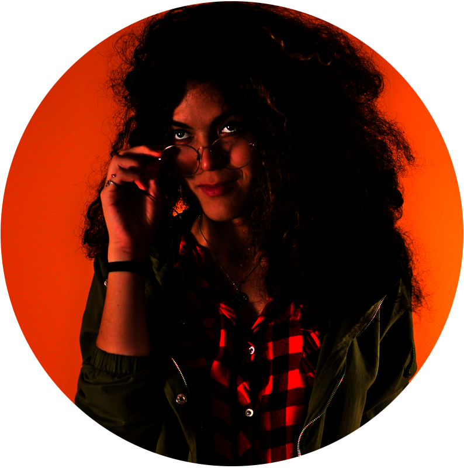

# Contatos

Encontre-me nos quartos onde moro de favor com meu trabalho. Este aqui é o meu espaço seguro, mas você também pode me acompanhar nas redes de sua preferência.

Você pode me acompanhar no Mastodon ([@danylamirinda@ursal.zone](https://ursal.zone/@danylamirinda)) e bater um papo. No Instagram ([@danielydasilva_](https://www.instagram.com/danielydasilva_/)), mesclo as fotos artísticas, do trabalho e pessoais. Também pode se comunicar comigo em [contato@danielysilva.com.br](mailto:contato@danielysilva.com.br).

Uso com mais frequência o Mastodon, onde você vai encontrar anedotas cotidianas e alguns desabafos. Deixei de usar a rede do passarinho há muito tempo, mesmo antes de o nome virar X. Adentrei o Mastodon sem entender bem a ideia do Fediverso, mas, com o tempo, ela me cativou.

Estou no Instagram, logo existo. Acho que boa parte de nós deveria ter um site pessoal. Mas, inevitavalmente, o Instagram ganhou um protagonismo sem precedentes nas nossas vidas. Comércio, arte e socialização. Estou por lá e apareço com frequência. Publico com mais frequência no perfil pessoal; tive a ideia de criar um perfil artístico, mas com o tempo percebi que o registro do cotidiano conta muito sobre a nossa arte. Ainda lanço algumas coisas no perfil artístico, Um Olhar Paisagístico, mas o seu lugar se tornou o de fotos mais selecionadas, enquanto o perfil pessoal é de caráter mais flexível.

{:style="display: block; margin: 0 auto" width="65%"}
