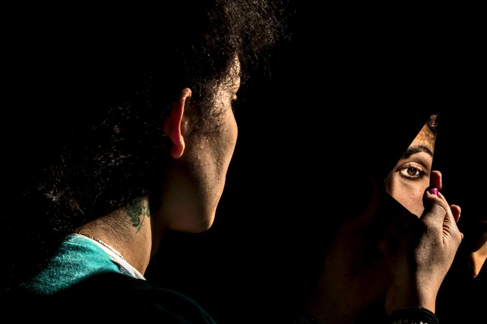
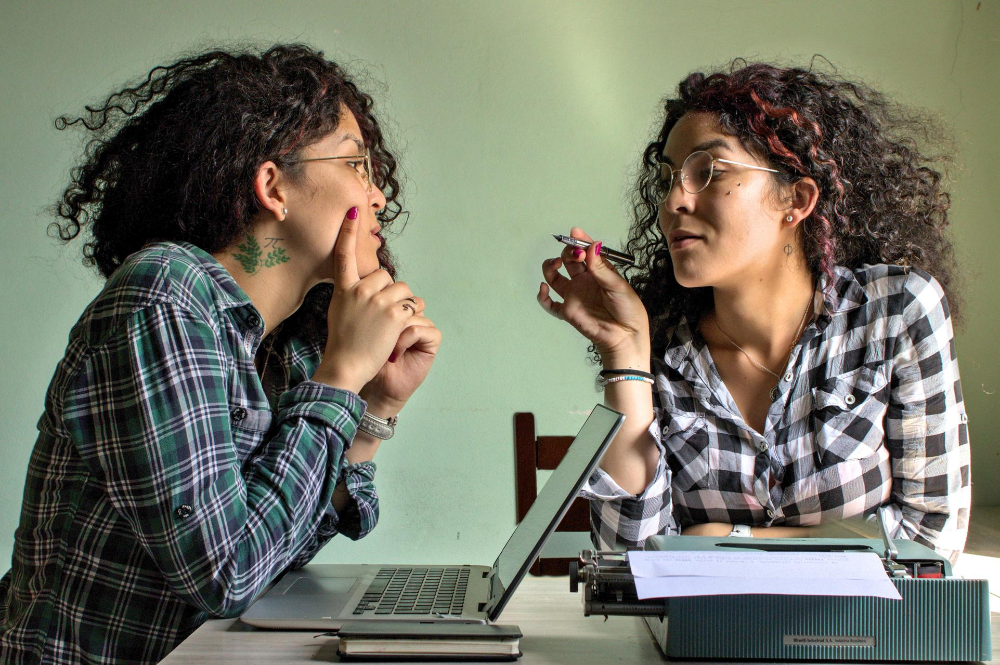
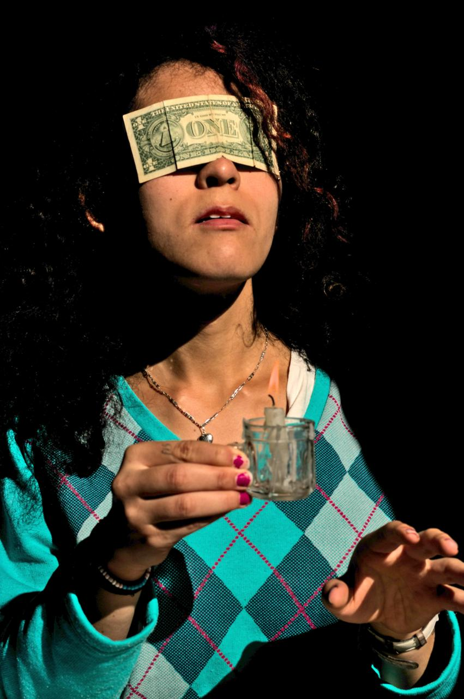
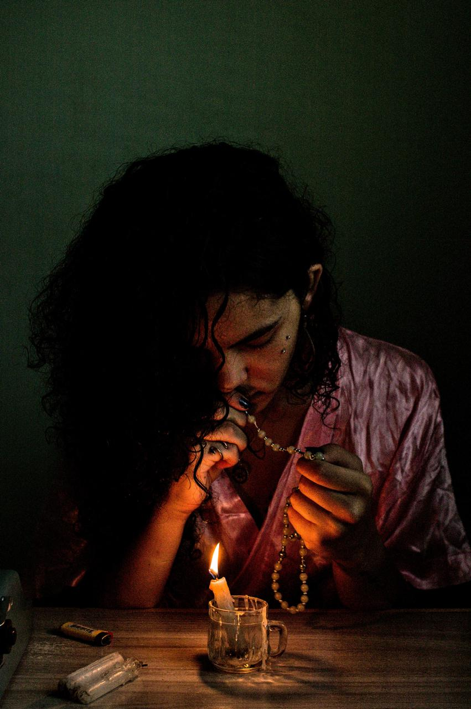
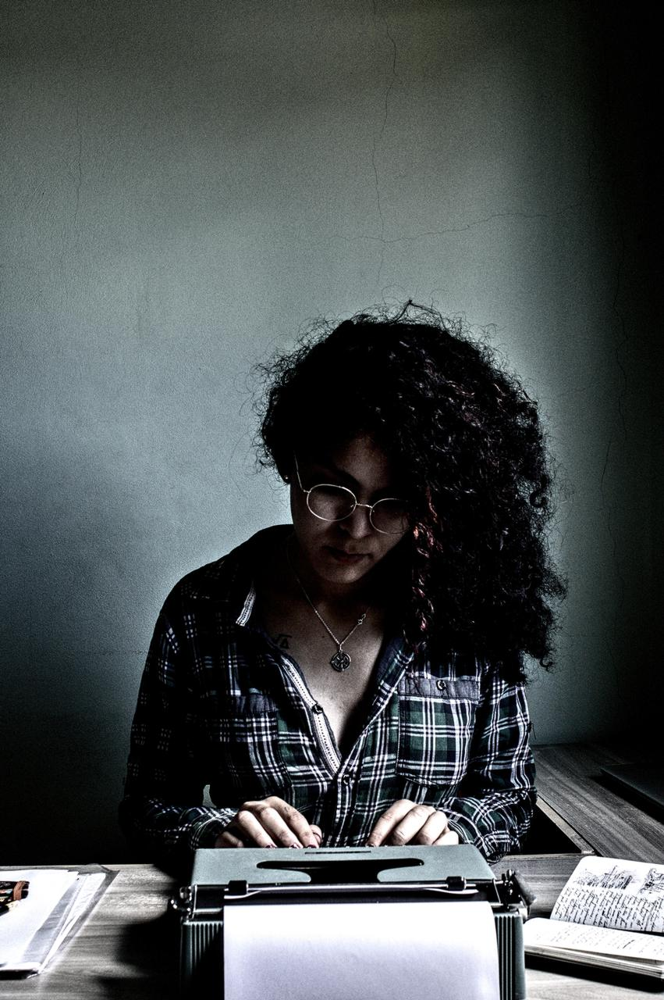
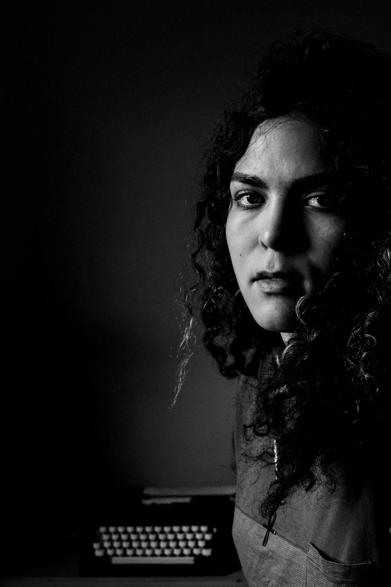

Autorretratar-se é um processo delicado. Estamos na posição de fotógrafa e personagem. Quanto de nós vamos expor? Estamos realmente mostrando o que somos ou interpretando?

A vida é uma constante atuação. Criamos nossas personagens, cujo diretor é o tempo e cada tomada é o momento. Autorretratar-se é fazer-se em duas, em retratada e retratante. A artista atrás da lente expulsa a alma de seu corpo, dirigindo-a nas melhores poses; a modelo, diante da paisagem, expulsa sua própria alma para dirigir a cena, desenhando com a luz e escrevendo a poesia da composição.

O tempo se torna flexível como numa corda e o relógio enlouquece. No autorretrato, não há passado; o presente se estende enquanto houver futuro. Em dez segundos de temporizador, uma obra se desenha.

{: width="100%"}
{: width="100%"}
{: width="100%"}
{: width="100%"}
{: width="100%"}
