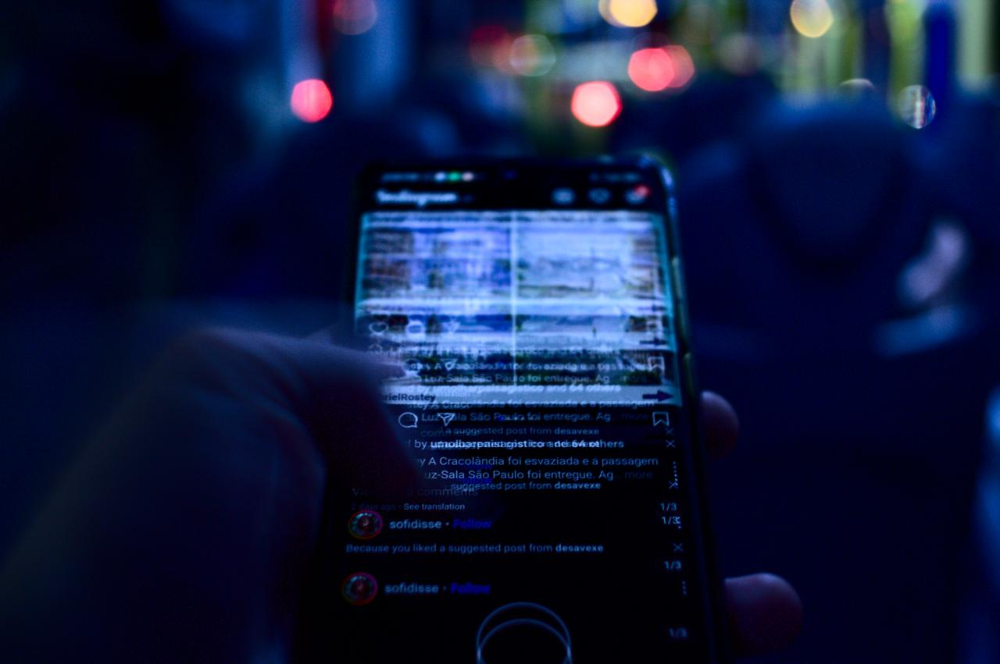
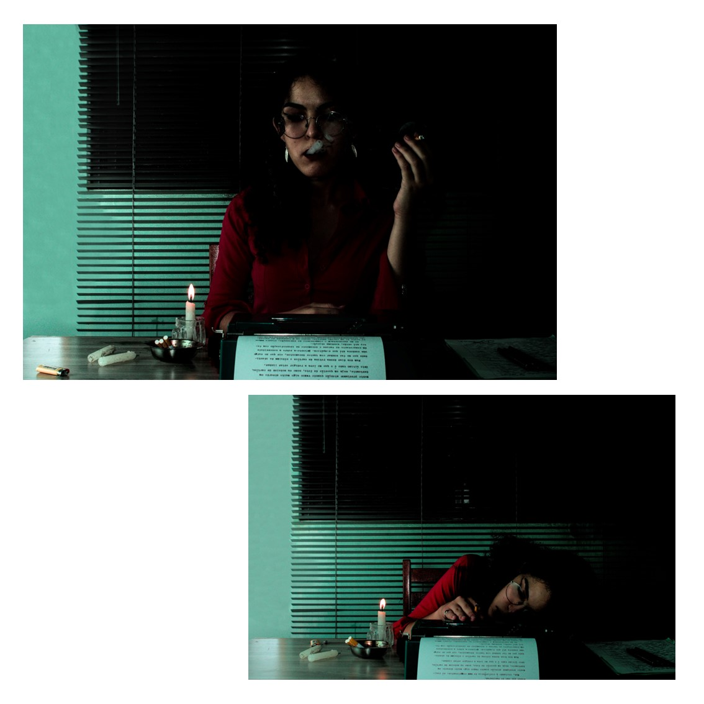
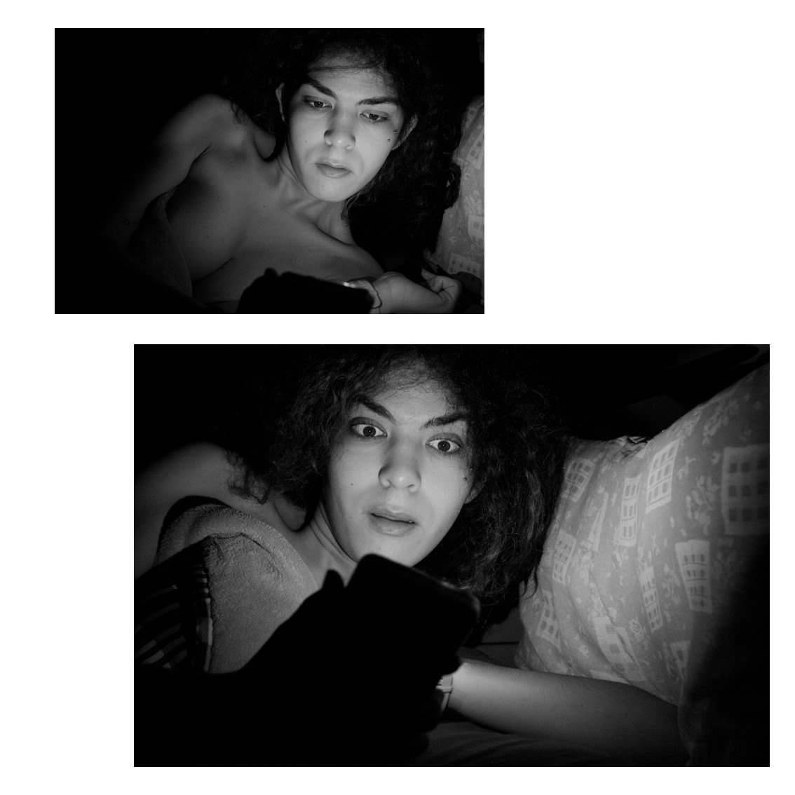
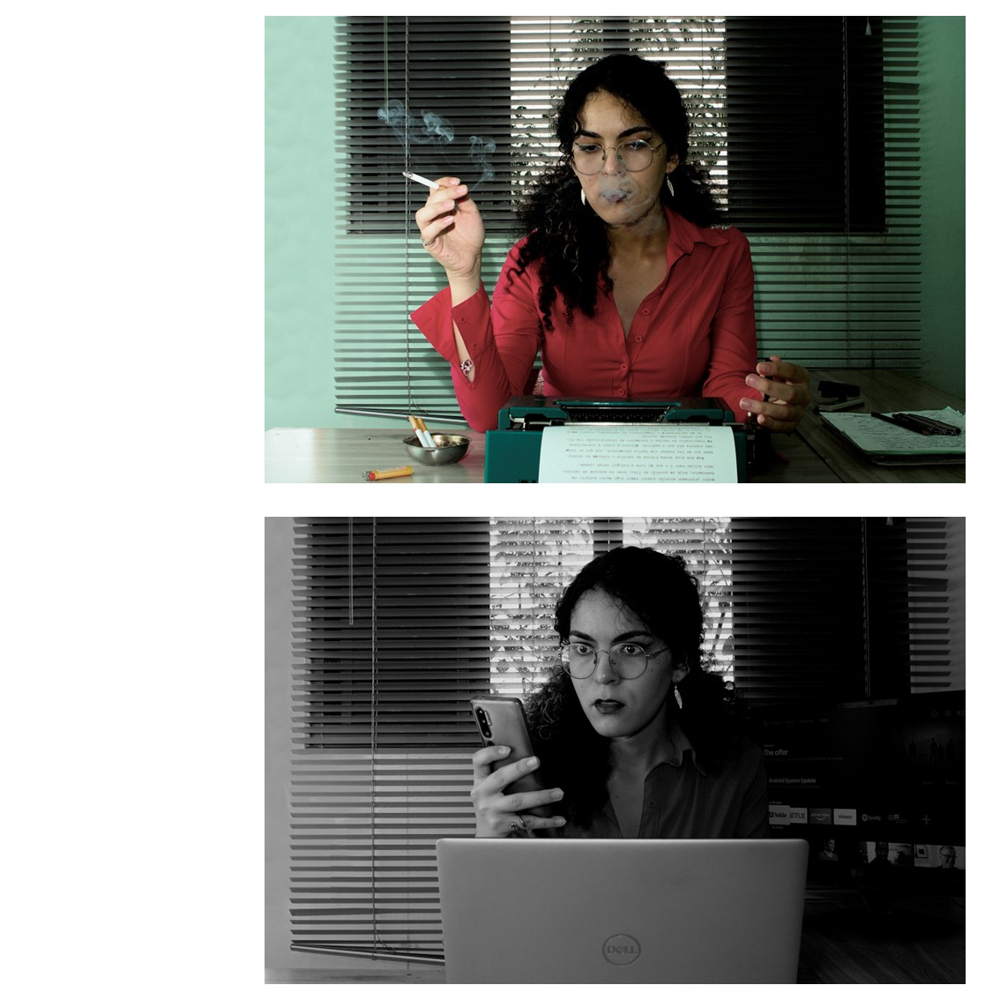
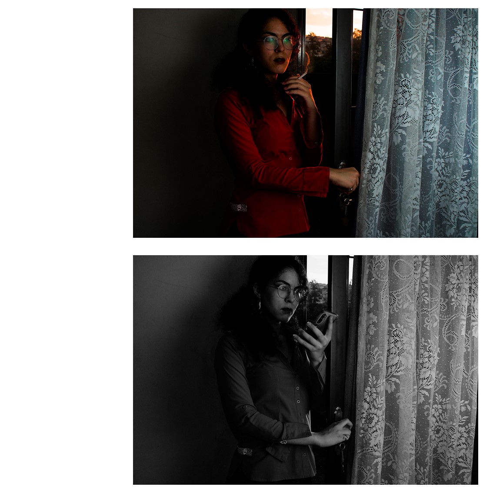
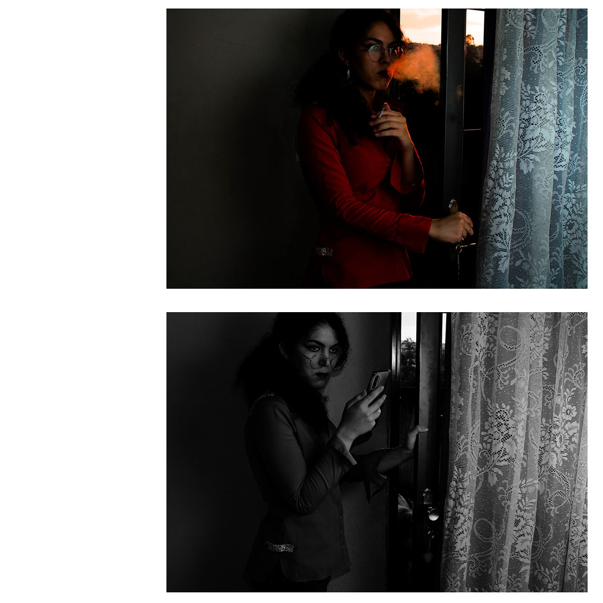
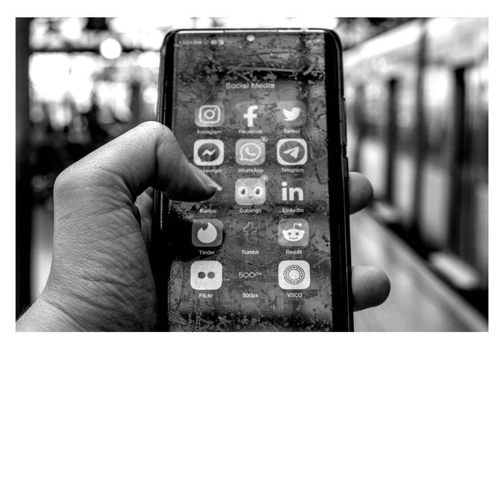
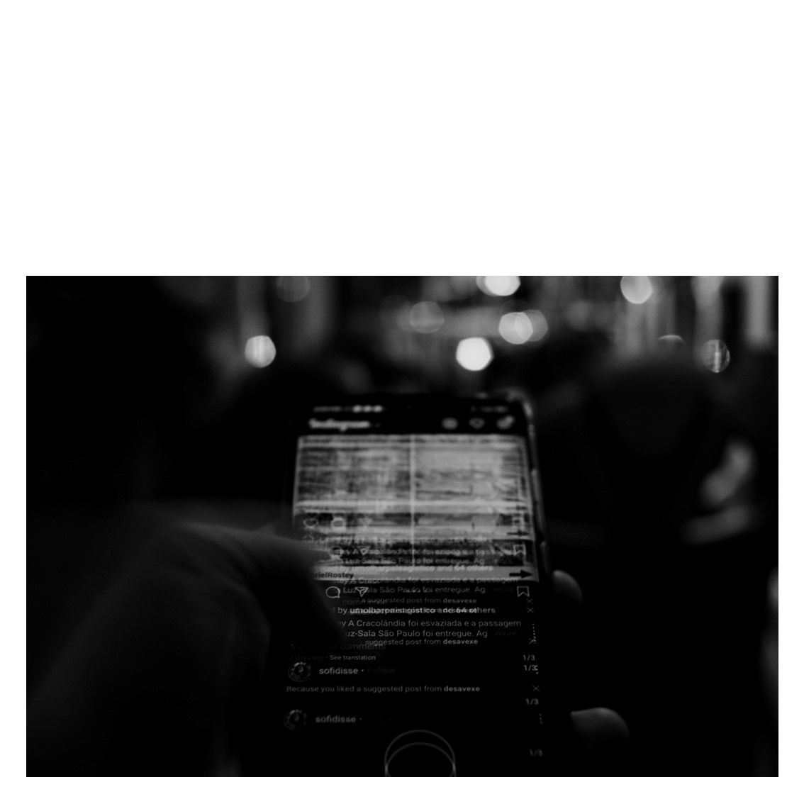
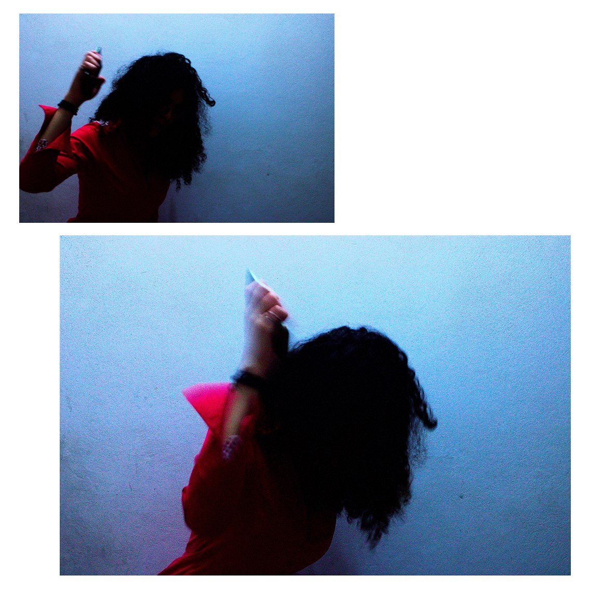
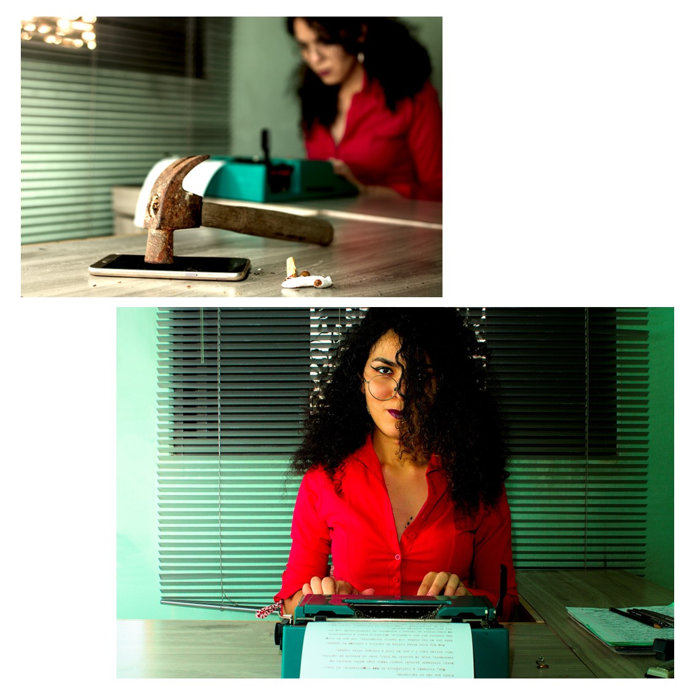

Cada época tem seus vícios. Algumas das imagens que nos remetem aos anos de 1970 são a máquina de escrever e o cigarro, em meio a ambientes e objetos coloridos. Talvez não seja a impressão mais precisa, estando mais próxima de um estereótipo. Mas me pergunto: qual seria a leitura que alguém, transportado diretamente da década de 1970 para os anos 2020, teria de nós? Parece um horror imaginar alguém fumando num escritório, num restaurante ou no transporte público. Mas nós estamos a todo momento atados a nosso telefone celular, sem a menor polidez. Se seria tão rude abrir um livro no meio de uma conversa, por que não temos pudor algum com o celular?

Estamos o tempo todo rodeados por nossos devices, que se propõe a nos auxiliar nas mais diversas tarefas. O cigarro também se propunha a relaxar e a concentrar, mas sabemos de todos os seus problemas. Talvez levemos tempo para nos dar conta do quão viciados somos nas tecnologias digitais. Aparelhos que roubam nossa concentração fazem com que, ao invés de a técnica nos sirva, nós nos tornemos seus servos. Telefones inteligentes ainda são uma tecnologia nova. Enquanto o rádio completou o centenário da presença no Brasil em 2022, os telefones inteligentes acabam de completar 15 anos, se consideramos o lançamento do primeiro iPhone.

Ainda é uma questão de tempo entendê-los, principalmente quando gradualmente ocupam mais aspectos de nossas vidas.

A comparação com o cigarro não pretende equipará-los em malefícios. São coisas diferentes, mas com algo em comum: em cada época, as pessoas não percebem o quão dependentes se tornaram. Diferente do cigarro, os aparelhos digitais não são de todo prejudiciais. Encontrar um equilíbrio é buscar uma pausa, um descanso para a mente. Afinal, rradicá-los de nossas vidas talvez traga tantos transtornos quanto a hipnose que nos causam.

Nesse processo, podemos descobrir que há outras formas de executar tarefas e que a lentidão também pode ser benéfica para nossa atenção.

{: width="100%"}
{: width="100%"}
{: width="100%"}
{: width="100%"}
{: width="100%"}
{: width="100%"}
{: width="100%"}
{: width="100%"}
{: width="100%"}
